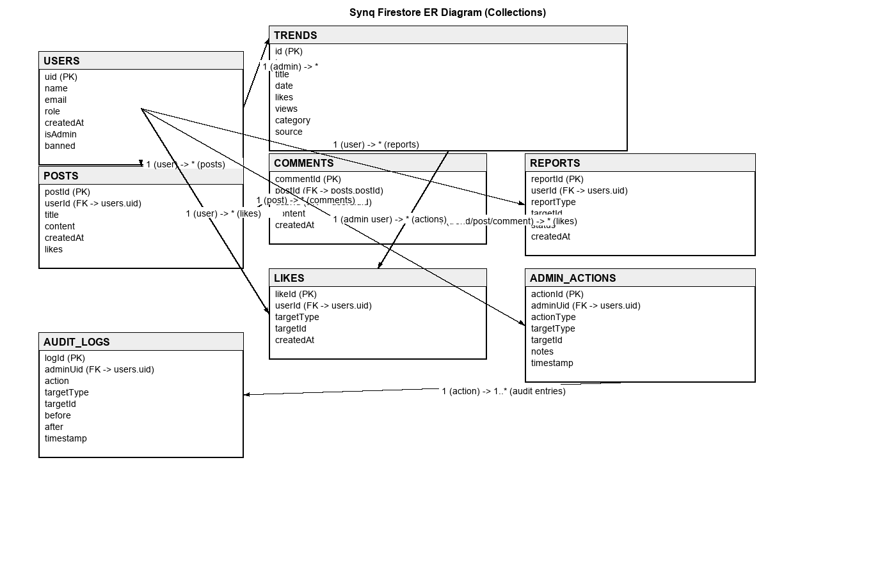

# Synq Database Design Document

## Project Overview

Synq is a Flutter-based trending information aggregation platform that syncs data from multiple sources (YouTube, stock markets, political news) and allows users to interact with trends through posts, comments, and reports. The application uses Google Firebase with Firestore as the primary database.

---

## Database Architecture

### Technology Stack

- **Database System:** Google Cloud Firestore (NoSQL, document-oriented)
- **Authentication:** Firebase Authentication
- **Real-time Sync:** Firestore real-time listeners and streams
- **Backend Services:** Firebase Cloud Functions (optional for Admin operations)

---

## Collections & Data Models

**ER Diagram**

Below is a visual ER-style diagram of the main Firestore collections and their primary relationships. The image `assets/db_diagram.png` is included in the repository.



### 1. **users** Collection

**Purpose:** Store user profiles and admin metadata  
**Document ID:** Firebase Authentication UID (auto-generated by Firebase Auth)

#### Schema:

```json
{
  "uid": "string (auto from Auth)",
  "name": "string",
  "email": "string",
  "role": "string (enum: 'user', 'admin')",
  "createdAt": "timestamp",
  "isAdmin": "boolean",
  "banned": "boolean (optional)"
}
```

#### Field Descriptions:

| Field     | Type      | Description                                | Required            |
| --------- | --------- | ------------------------------------------ | ------------------- |
| uid       | String    | Firebase Auth UID (doc ID)                 | Yes                 |
| name      | String    | User's display name                        | Yes                 |
| email     | String    | User's email address                       | Yes                 |
| role      | String    | User role (user/admin)                     | Yes                 |
| createdAt | Timestamp | Account creation date                      | Yes                 |
| isAdmin   | Boolean   | Admin privilege flag (short-term approach) | No (default: false) |
| banned    | Boolean   | Ban status for user moderation             | No (default: false) |

#### Indexes:

- Single field: `email` (ascending)
- Single field: `isAdmin` (ascending)
- Single field: `banned` (ascending)

#### Use Cases:

- User authentication & profile lookup
- Admin permission checks (Firestore rules read `users/{uid}.isAdmin`)
- User ban enforcement
- User management dashboard queries

---

### 2. **trends** Collection

**Purpose:** Store trending items aggregated from multiple APIs (YouTube, stocks, political news)  
**Document ID:** Auto-generated by Firestore

#### Schema:

```json
{
  "id": "string",
  "type": "string (enum: 'youtube', 'stock', 'political')",
  "title": "string",
  "description": "string",
  "date": "timestamp",
  "likes": "integer",
  "views": "integer",
  "category": "string",
  "source": "string",
  "imageUrl": "string",
  "link": "string"
}
```

#### Field Descriptions:

| Field       | Type      | Description                                          | Required        |
| ----------- | --------- | ---------------------------------------------------- | --------------- |
| id          | String    | Unique identifier from source API                    | Yes             |
| type        | String    | Trend type: 'youtube', 'stock', 'political'          | Yes             |
| title       | String    | Trend title/name                                     | Yes             |
| description | String    | Detailed description                                 | Yes             |
| date        | Timestamp | Date when trend was recorded                         | Yes             |
| likes       | Integer   | User engagement counter                              | No (default: 0) |
| views       | Integer   | View count                                           | No (default: 0) |
| category    | String    | Trend category (e.g., 'Entertainment', 'Technology') | No              |
| source      | String    | Original data source API                             | Yes             |
| imageUrl    | String    | SVG or image URL                                     | No              |
| link        | String    | External link to source                              | No              |

#### Indexes:

- Composite: `date` (descending), `likes` (descending), `__name__` (descending)
- Composite: `type` (ascending), `date` (descending)
- Single field: `date` (descending)

#### Security Rules:

- **Read:** Authenticated users only
- **Write:** Only admins (checked via `users/{uid}.isAdmin == true`)

#### Use Cases:

- Display trending feeds (YouTube, stocks, politics)
- Filter trends by type and date range
- Sync trends from external APIs
- Admin-only trend management (add/update/delete)

---

### 3. **posts** Collection

**Purpose:** Store user-created posts (discussions, commentary on trends)  
**Document ID:** Auto-generated by Firestore

#### Schema:

```json
{
  "userId": "string",
  "title": "string",
  "content": "string",
  "createdAt": "timestamp",
  "likes": "integer",
  "comments": "integer",
  "tags": ["string"],
  "comments": {
    "[commentId]": {
      "userId": "string",
      "content": "string",
      "createdAt": "timestamp",
      "likes": "integer"
    }
  }
}
```

#### Parent Document (posts/{postId}):

| Field     | Type      | Description                 | Required         |
| --------- | --------- | --------------------------- | ---------------- |
| userId    | String    | Creator's Firebase Auth UID | Yes              |
| title     | String    | Post title                  | Yes              |
| content   | String    | Post content/body           | Yes              |
| createdAt | Timestamp | Post creation date          | Yes              |
| likes     | Integer   | Like count                  | No (default: 0)  |
| comments  | Integer   | Comment count               | No (default: 0)  |
| tags      | Array     | Topic tags                  | No (default: []) |

#### Sub-collection: **posts/{postId}/comments**

**Document ID:** Auto-generated

| Field     | Type      | Description           | Required        |
| --------- | --------- | --------------------- | --------------- |
| userId    | String    | Comment author UID    | Yes             |
| content   | String    | Comment text          | Yes             |
| createdAt | Timestamp | Comment creation date | Yes             |
| likes     | Integer   | Comment like count    | No (default: 0) |

#### Indexes:

- Composite: `createdAt` (descending), `likes` (descending)

#### Security Rules:

- **Read:** Authenticated users only
- **Create/Update:** Author only for post; any authenticated user can comment
- **Delete:** Post author or comment author only

#### Use Cases:

- User discussion forum
- Commentary on trends
- Community engagement (likes, comments)
- Feed generation

---

### 4. **reports** Collection

**Purpose:** Store user-generated reports (issue reports, content moderation, feedback)  
**Document ID:** Auto-generated by Firestore

#### Schema:

```json
{
  "userId": "string",
  "reportType": "string (enum: 'bug', 'inappropriate', 'spam', 'other')",
  "targetId": "string (optional, reference to post/user/trend)",
  "targetType": "string (enum: 'post', 'user', 'trend', 'comment', 'other')",
  "title": "string",
  "description": "string",
  "createdAt": "timestamp",
  "status": "string (enum: 'pending', 'reviewed', 'resolved', 'dismissed')",
  "adminNotes": "string (optional)"
}
```

#### Field Descriptions:

| Field       | Type      | Description                                   | Required                |
| ----------- | --------- | --------------------------------------------- | ----------------------- |
| userId      | String    | Reporter's Firebase Auth UID                  | Yes                     |
| reportType  | String    | Type: 'bug', 'inappropriate', 'spam', 'other' | Yes                     |
| targetId    | String    | ID of reported item (post/user/trend)         | No                      |
| targetType  | String    | Type of reported item                         | No                      |
| title       | String    | Report title/subject                          | Yes                     |
| description | String    | Detailed report description                   | Yes                     |
| createdAt   | Timestamp | Report submission date                        | Yes                     |
| status      | String    | Status: pending/reviewed/resolved/dismissed   | No (default: 'pending') |
| adminNotes  | String    | Admin notes/resolution                        | No                      |

#### Indexes:

- Single field: `status` (ascending)
- Single field: `userId` (ascending)
- Composite: `createdAt` (descending), `status` (ascending)

#### Security Rules:

- **Read:** Admins only
- **Create:** Authenticated users only
- **Update:** Admins only

#### Use Cases:

- Bug/issue tracking
- Content moderation queue
- User feedback collection
- Admin oversight and resolution tracking

---

## Relationships & Referential Integrity

### User → Posts

- **Type:** One-to-Many
- **Reference:** `posts.userId` → `users.uid`
- **Cascade:** Soft delete (archive posts when user banned)

### User → Comments

- **Type:** One-to-Many
- **Reference:** `posts/{postId}/comments.userId` → `users.uid`

### User → Reports

- **Type:** One-to-Many
- **Reference:** `reports.userId` → `users.uid`

### Posts → Comments

- **Type:** One-to-Many
- **Structure:** Sub-collection `posts/{postId}/comments`

### Trends (independent)

- No direct foreign keys; trends are aggregated from external APIs
- Referenced indirectly in posts/comments via trend IDs in content

---

## Firestore Security Rules

### Overview

Security rules are enforced server-side in Firestore to ensure:

- Authenticated access only
- Admin-only write operations for sensitive collections
- User data privacy (read own data)
- Admin privilege checks via `users/{uid}.isAdmin` flag

### Current Rules Structure

```
rules_version = '2';
service cloud.firestore {
  match /databases/{database}/documents {

    // Users collection
    match /users/{userId} {
      allow read: if request.auth.uid == userId || request.auth.uid != null;
      allow write: if request.auth.uid == userId ||
        (request.auth.uid != null &&
         get(/databases/$(database)/documents/users/$(request.auth.uid)).data.isAdmin == true);
      allow create: if request.auth.uid != null;
    }

    // Trends collection (read all, admin write only)
    match /trends/{docId} {
      allow read: if request.auth.uid != null;
      allow write: if request.auth.uid != null &&
        get(/databases/$(database)/documents/users/$(request.auth.uid)).data.isAdmin == true;
    }

    // Posts collection
    match /posts/{docId} {
      allow read: if request.auth.uid != null;
      allow write: if request.auth.uid == resource.data.userId;
      allow create: if request.auth.uid != null && request.resource.data.userId == request.auth.uid;

      // Comments sub-collection
      match /comments/{commentId} {
        allow read: if request.auth.uid != null;
        allow create: if request.auth.uid != null;
        allow write: if request.auth.uid == resource.data.userId;
        allow delete: if request.auth.uid == resource.data.userId;
      }
    }

    // Reports collection
    match /reports/{docId} {
      allow read: if request.auth.uid != null;
      allow write: if request.auth.uid == resource.data.userId;
      allow create: if request.auth.uid != null && request.resource.data.userId == request.auth.uid;
    }

    // Deny all other access
    match /{document=**} {
      allow read, write: if false;
    }
  }
}
```

---

## Data Flow & Operations

### User Registration Flow

1. Firebase Auth creates user account
2. AuthService creates document in `users/{uid}` collection
3. Stores: `email`, `name`, `role`, `createdAt`, `isAdmin: false`

### Trend Sync Flow

1. Admin initiates sync (via AdminService or scheduled function)
2. External APIs (YouTube, Stock, Political) return data
3. Data transformed to Synq schema
4. Batch write to `trends` collection
5. Only admins can write (enforced by Firestore rules)

### Post & Comment Flow

1. User creates post → document added to `posts/{postId}`
2. User adds comment → sub-document added to `posts/{postId}/comments/{commentId}`
3. Like counter incremented via transaction
4. Real-time listeners notify UI of changes

### Report Submission Flow

1. User creates report → document added to `reports/{reportId}`
2. Admin reviews reports (read access via security rules)
3. Admin updates `status` and `adminNotes`
4. User can view own reports via `userId` filter

---

## Performance Considerations

### Indexing Strategy

- **Composite indexes** for multi-field queries (trends, reports)
- **Single-field indexes** for frequently filtered fields (email, isAdmin, status)
- **Date-based indexes** for feed pagination (createdAt descending)

### Query Optimization

- Firestore auto-pagination using `limit()` and `startAfter()`
- Stream-based real-time updates for feeds (avoid constant polling)
- Batch reads for admin dashboards

### Storage Estimates

- `users`: ~1KB per document; scale: ~1000-10000 users → 10-100 MB
- `trends`: ~2KB per document; scale: ~50000 trends → 100 MB (auto-purged >90 days)
- `posts`: ~1-3KB per document; scale: ~10000 posts → 10-30 MB
- `comments`: ~500B per document; sub-collection scaling with posts
- **Total estimated (small scale):** 150-300 MB

### Firestore Cost Optimization

- Read quota: ~10M reads/month (free tier: 50K/day)
- Write quota: ~1M writes/month (free tier: 20K/day)
- Delete operations count as writes

---

## Admin Operations

### Accessible via AdminService

- `setAdmin(uid, boolean)` - Promote/demote admin
- `setBanned(uid, boolean)` - Ban/unban user
- `deleteUser(uid)` - Remove user document
- `purgeOldTrends(days)` - Delete trends older than N days
- `fetchUsers(limit)` - Stream user list

### Future Enhancements

- Custom claims via Firebase Admin SDK (more secure than `isAdmin` flag)
- Audit logging collection for compliance
- Admin activity tracking
- Batch imports/exports

---

## Security & Compliance

### Current Short-term Approach

- `isAdmin` boolean stored in Firestore document
- Client reads flag; Firestore rules server-side verify on write
- Sufficient for MVP/demo; not production-grade

### Recommended Long-term Approach

- Migrate to Firebase Custom Claims
- Set `admin: true` claim on auth user via Admin SDK
- Update rules to check `request.auth.token.admin == true`
- Prevents client-side tampering; claims are issued by secure backend

### Data Privacy

- User data private by default (read own doc only)
- Admins can read/update any user document for moderation
- Reports visible to admins only
- No user data is exposed to unauthenticated requests

---

## Backup & Recovery

### Firestore Backup Strategy

- **Google Cloud Firestore** provides built-in backups (via Cloud Firestore export)
- Manual exports can be scheduled weekly/monthly to Cloud Storage
- Restore from export within Firebase Console

### Data Retention Policy

- Trends: Auto-purge >90 days (via `purgeOldTrends()`)
- Posts/Comments: Kept indefinitely (user can delete)
- Reports: Kept for 1 year minimum for audit trail
- User accounts: Soft-deleted (banned flag) or hard-deleted on request

---

## Conclusion

The Synq database is designed as a scalable, real-time platform leveraging Firestore's NoSQL architecture. Security rules enforce authorization at the database layer, ensuring data integrity and privacy. The schema supports trend aggregation, user interaction (posts/comments), and admin oversight with efficient querying and minimal data redundancy.

**Key Design Principles:**

- Security-first: server-side rule enforcement
- Real-time: stream-based updates via Firestore listeners
- Scalability: document-based partitioning, indexed queries
- User Privacy: authenticated access, minimal data exposure
- Admin Control: moderation tools and audit trails

---

## Appendix: Example Queries

### 1. Fetch trending YouTube videos (last 7 days, sorted by likes)

```dart
db.collection('trends')
  .where('type', isEqualTo: 'youtube')
  .where('date', isGreaterThanOrEqualTo: Timestamp.fromDate(DateTime.now().subtract(Duration(days: 7))))
  .orderBy('date', descending: true)
  .orderBy('likes', descending: true)
  .limit(20)
  .snapshots()
```

### 2. Fetch user's own posts with comments

```dart
db.collection('posts')
  .where('userId', isEqualTo: currentUserId)
  .orderBy('createdAt', descending: true)
  .snapshots()

// For each post, listen to comments sub-collection
db.collection('posts').doc(postId).collection('comments').snapshots()
```

### 3. Fetch pending reports (admin only)

```dart
db.collection('reports')
  .where('status', isEqualTo: 'pending')
  .orderBy('createdAt', descending: true)
  .snapshots()
```

### 4. Check if user is admin

```dart
db.collection('users').doc(uid).get()
  .then(doc => doc.data()['isAdmin'] == true)
```

---

**Document Version:** 1.0  
**Last Updated:** January 14, 2026  
**Project:** Synq  
**Database:** Google Cloud Firestore
